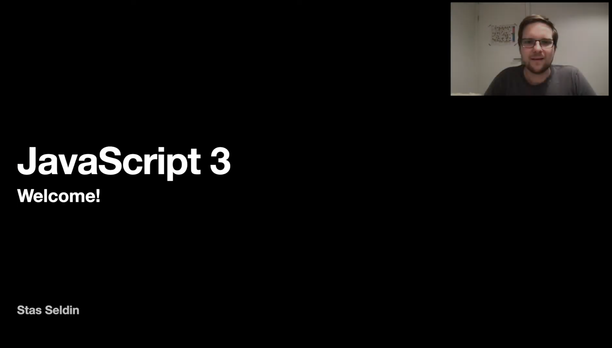

> Please help us improve and share your feedback! If you find better tutorials
> or links, please share them by [opening a pull request](https://github.com/HackYourFuture/JavaScript3/pulls).

# Module #4 - JavaScript 3: Object-Oriented Programming and working with APIs (Frontend)


Welcome to JavaScript3! Congratulations on making it this far. You're well on your way to the top!

A big part of being a programmer means moving data from one place to another. It also means working with other people's software. In this module you'll be learning about one of the core things of what makes a web developer: working with APIs!

On top of that you'll also learn how to think differently about _how_ you write your programs. Like in any field, once you've mastered a particular way of doing things you start thinking about how it could be done in a smarter, different way. In programming we call these `paradigms` and in this module you'll learn one such paradigm: Object-Oriented Programming!

## Before you start

### Setup Style Guide

In the following weeks we will be using a front-end `style guide` to help you write _"clean code"_. What is a style guide? Simply put, it's a set of coding standards put into one collection.

- [Front-end Style Guides](https://fronteers.nl/congres/2015/sessions/front-end-style-guides-anna-debenham)

The style guide we'll be using is the one from Airbnb:

- [Airbnb JavaScript Style Guide](https://github.com/airbnb/javascript)

While you do not need to read this guide in detail, it is recommended that you look at sections 1-8, 12-13, 15-21 and 23.

The required packages you need to install before you write code according to the style guide are the following:

```json
"eslint"
"eslint-config-airbnb-base"
"eslint-config-prettier"
"eslint-plugin-import"
"eslint-plugin-prettier"
"prettier"
```

They are already in this repository's `package.json` so all you have to do now to prepare is to execute the following command at the root of this module directory:

```md
npm install
```

### Forking the right repository

Before you start with the homework, make sure you've made a fork of the right repository: [HackYourHomework/JavaScript3](https://www.github.com/hackyourhomework/javascript3)). Once you've cloned it to your computer you can proceed by making GIT branches for each week. Start at the `master` branch and execute the following (note that they're 3 different commands):

```bash
foo@bar:~$ git branch week1-YOURNAME
foo@bar:~$ git branch week2-YOURNAME
foo@bar:~$ git branch week3-YOURNAME
```

Then execute `git checkout week1-YOURNAME` and you can get started!

If you have any questions or if something is not entirely clear ¯\_(ツ)\_/¯, please ask/comment on Slack!

## Learning goals

In order to successfully complete this module you will need to master the following:

- Learn what an `Application Programming Interface` (API) is
- Catch up on the `history of JavaScript`
- Understand how to write more readable `asynchronous JavaScript`
- Connect with different `public APIs`
- Build a `Single Page Application` (SPA)
- Work with pre-existing code
- Learn about `Object-Oriented Programming`

## How to use this repository

### Repository content

This repository consists of 3 essential parts:

1. `README`: this document contains all the required theory you need to understand **while** working on the homework. It contains not only the right resources to learn about the concepts, but also lectures done by HackYourFuture teachers. This is the **first thing** you should start with every week
2. `MAKEME`: this document contains the instructions for each week's homework. Start with the exercises rather quickly, so that you can ground the concepts you read about earlier.
3. `LESSONPLAN`: this document is meant for teachers as a reference. However, as a student don't be shy to take a look at it as well!

### How to study

Let's say you are just starting out with the JavaScript2 module. This is what you do...

1. The week always starts on **Wednesday**. First thing you'll do is open the `README.md` for that week. For the first week of `JavaScript2`, that would be [Week1 Reading](/Week1/README.md)
2. You spend **Wednesday** and **Thursday** going over the resources and try to get a basic understanding of the concepts. In the meanwhile, you'll also implement any feedback you got on last week's homework (from the JavaScript1 module)
3. On **Friday** you start with the homework, found in the `MAKEME.md`. For the first week of `JavaScript2`, that would be [Week1 Homework](/Week1/MAKEME.md)
4. You spend **Friday** and **Saturday** playing around with the exercises and write down any questions you might have
5. **DEADLINE 1**: You'll submit any questions you might have before **Saturday 23.59**, in the class channel
6. On **Sunday** you'll attend class. It'll be of the Q&A format, meaning that there will be no new material. Instead your questions shall be discussed and you can learn from others
7. You spend **Monday** and **Tuesday** finalizing your homework
8. **DEADLINE 2**: You submit your homework to the right channels (GitHub) before **Tuesday 23.59**. If you can't make it on time, please communicate it with your mentor
9. Start the new week by going back to point 1!

In summary:


To have a more detailed overview of the guidelines, please read [this document](https://docs.google.com/document/d/1JUaEbxMQTyljAPFsWIbbLwwvvIXZ0VCHmCCN8RaeVIc/edit?usp=sharing) or ask your mentor/class on Slack!

### Video lectures

For each module HackYourFuture provides you with video lectures. These are made by experienced software developers who know what they're talking about. The main teacher for this module will be [Stasel Seldin](https://hackyourfuture.slack.com/team/UQJGC1MSL): senior iOS developer!

You can find out more about him here:

- [GitHub](https://github.com/Stasel)
- [@Stasel on Slack](https://hackyourfuture.slack.com/team/UQJGC1MSL)

Learn from Stasel in the following playlist of videos he has made for you! (Click on the image to open the link)

<a href="https://www.youtube.com/watch?v=j7X0_KwoRD4&list=PLVYDhqbgYpYVchJ9QQ3rC2WxYKrOiceYX" target="_blank"></a>

## Planning

| Week | Topic                                                                                       | Reading Materials              | Homework                        | Lesson Plan                            |
| ---- | ------------------------------------------------------------------------------------------- | ------------------------------ | ------------------------------- | -------------------------------------- |
| 1.   | Application Programming Interface (API), AJAX, Modules & Libraries                          | [Reading W1](/Week1/README.md) | [Homework W1](/Week1/MAKEME.md) | [Lesson Plan W1](/Week1/LESSONPLAN.md) |
| 2.   | Promises, Fetch API, JavaScript Versions, 'this' keyword, Arrow functions                   | [Reading W2](/Week2/README.md) | [Homework W2](/Week2/MAKEME.md) | [Lesson Plan W1](/Week2/LESSONPLAN.md) |
| 3.   | Object-Oriented Programming (OOP), ES6 Classes, Async/await, Thinking like a programmer III | [Reading W3](/Week3/README.md) | [Homework W3](/Week3/MAKEME.md) | [Lesson Plan W1](/Week3/LESSONPLAN.md) |
| 4.   | Final JavaScript Test                                                                       | [Details](test.md)             | -                               | -                                      |

## Finished?

Did you finish the module? High five!

If you feel ready for the next challenge, click [here](https://www.github.com/HackYourFuture/Node.js) to go to Node.js!

_The HackYourFuture curriculum is subject to CC BY copyright. This means you can freely use our materials, but just make sure to give us credit for it :)_

<a rel="license" href="http://creativecommons.org/licenses/by/4.0/"></a><br />This work is licensed under a <a rel="license" href="http://creativecommons.org/licenses/by/4.0/">Creative Commons Attribution 4.0 International License</a>.
