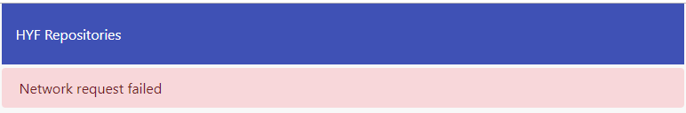

# Homework Week 1

```
Topics discussed this week:
• Structure for a basic SPA
• XMLHttpRequests
• API calls
```

## Step 1: Single Page Application :sweat_drops:

**_Deadline Thursday_**

_This homework is more extensive and challenging than previous homework! Please read the instructions below carefully and follow them with great attention to detail. Start this homework as soon as you can and allow time for discussion and questions (slack!)._

### 1.1 Introduction

> In this assignment you will built upon some existing code that is already pre-written by your teachers. Your homework consist of writing the code to make the application work as requested per week.

You are going to write a _Single Page Application_ (SPA) that uses the [GitHub API](https://developer.github.com/guides/getting-started/).

This application should display information about the available [HYF GitHub repositories](https://github.com/hackyourfuture). The functionalities we would like to see in your application are as follows:

- The user should be able to select a repository from a list of available repositories.
- The application should display high-level information about the selected repository and show a list of its contributors.
- When clicking on the name of the selected repository the GitHub page for the corresponding repository should be opened in a new browser tab.
- When clicking on a contributor, the GitHub page for the contributor should be opened in a new browser tab.

Figure 1 below shows an example of what your application could look like. Note that this is just an example. If you find it boring or unimaginative, please improve on it! On the other hand, a simpler version is OK too, so long as you implement the expected functionality.


<small>Figure 1. Example User Interface using [Material Design](https://material.io/guidelines/) principles.</small>

A live version of this application can be found here: http://hyf-github.netlify.com/

### 1.2 The GitHub API

#### 1.2.1 Get a list of HYF repositories

You can fetch a list of HYF repositories through this API endpoint ([What is an API Endpoint?](https://teamtreehouse.com/community/what-is-an-api-endpoint)):

```
https://api.github.com/orgs/HackYourFuture/repos?per_page=100
```

If you open this URL in the browser (_try it!_) you will receive JSON data about the available HYF repositories. This is the data that you will need to work with in this assignment.

<small>Note the query string `?per_page=100` in the above URL. If you don't specify this query string you will only get the first 30 repositories (the default `per_page` is 30). HackYourFuture has more than 30 repositories but less than 100.</small>

The returned JSON data contains some basic information about each repository, such as `name`, `full_name`, `description` etc. There are also many properties that contain URLs that can be used to obtain detail information about certain aspects of the repository.

#### 1.2.2 Get contributor information for a repository

The JSON data that is returned from the initial request to get repository information includes a property named `contributors_url`. Use the value of this property to fetch a list of contributors.

#### 1.2.3 GitHub API documentation

You can find detailed information about the GitHub API by means of the link listed below. However, the documentation is very extensive and not easy to digest. For this homework it is not necessary to study the GitHub API documentation. We provide the link here for completeness.

> GitHub API documentation: https://developer.github.com/v3/

### 1.3 Coding Style

In the JavaScript3 module, we will be introducing a preferred coding style and supporting tools to help you write _"clean code"_. There are a number of popular JavaScript "style guides" available of which the one developed by Airbnb will be adopted for this homework. It is documented here:

- [Airbnb JavaScript Style Guide](https://github.com/airbnb/javascript)

While you do not need to read this guide in detail, it is recommended that you review sections 1-8, 12-13, 15-21 and 23. Adherence to many of the recommendations of this guide is enforced in this homework by tools installed during the project preparation step below. You will see error and warning messages in the VSCode editor when your code deviates from the recommended style. An additional check will be done when you submit your homework as a pull request on GitHub.

### 1.5 Preparation

You will be working on this same application during the next three weeks. For each week you will need to create a new Git branch, as listed in the Table 1 below.

| Week | Branch  | Assignment                                                                                       |
| :--: | ------- | ------------------------------------------------------------------------------------------------ |
|  1   | `week1` | Create a basic application using callbacks to handle network requests.                           |
|  2   | `week2` | - Refactor the callbacks to promises.<br>- Make the UI responsive.                               |
|  3   | `week3` | - Refactor the application to use ES6 Classes and async/await.<br>- Make the app ARIA-compliant. |

<small>Table 1. Homework schedule</small>

**Instructions**

1. Fork the JavaScript3 repository (_this repository_) to your own GitHub account.
2. Clone the fork to your laptop.
3. Open the `JavaScript3` folder from the cloned repository in VSCode.
4. Install the following extension in VSCode:

   **Prettier - Code formatter**.

5. Open a Terminal window in VSCode and type the following command to install Prettier and ESLint tools required for the homework:

   ```
   npm install
   ```

6. Create a new branch for the week 1 homework with the following command:

   ```
   git checkout -b week1
   ```

### 1.5 Code Overview

The files that make up the application are located in the `homework` folder. It contains the following files:

| Filename             | Description                       |
| -------------------- | --------------------------------- |
| ~~`App.js`~~         | Not used in week 1 and 2.         |
| ~~`Contributor.js`~~ | Not used in week 1 and 2.         |
| `hyf.png`            | Contains the HackYourFuture logo. |
| `index.html`         | The application's HTML file.      |
| ~~`index2.html`~~    | Not used in week 1 and 2.         |
| `index.js`           | A starter JavaScript file.        |
| ~~`Repository.js`~~  | Not used in week 1 and 2.         |
| `style.css`          | A starter CSS file.               |
| ~~`Util.js`~~        | Not used in week 1 and 2.         |

In week 1, you should only modify `index.js` and `style.css`.

_**Do not modify any other files at this time!**_

> Although you should only modify files in the `homework` folder, we recommend that you always open the `JavaScript3` folder rather tham the `homework` folder in VSCode. The `JavaScript3` folder contains the actual git repository.

#### 1.5.1 A first examination

1. Open `index.html` and examine its contents (but don't modify anything). Notice that the HTML `body` looks like this:

   ```html
   <body>
     <div id="root"></div>
     <script src="./index.js"></script>
   </body>
   ```

   The `body` tag contains a single `div` to which you will need to dynamically append HTML elements through your JavaScript code in `index.js`.

2. Open `index.js`. This file contains a starter set of code for you to expand. It contains the following three functions:

   | Function          | Description                                                                                                  |
   | ----------------- | ------------------------------------------------------------------------------------------------------------ |
   | `fetchJSON`       | Uses `XMLHttpRequest` to fetch JSON data from an API end point. This function uses an asynchronous callback. |
   | `createAndAppend` | A utility function for easily creating and appending HTML elements.                                          |
   | `main`            | Contains the start-up code for the application.                                                              |

   `index.js` also contains a constant with the URL for the HYF repositories as listed in section 2.2.1:

   ```js
   const HYF_REPOS_URL = 'https://api.github.com/orgs/HackYourFuture/repos?per_page=100';
   ```

3. Open the `index.html` file in your browser. Notice that it produces the same JSON output that you saw previously when you opened the URL directly in the browser.

4. Review the `main()` function in `index.js` and examine how this code renders the JSON output in the browser by means of a `pre` HTML element (for demonstration purposes).

### 1.6 Week 1 Assignment

The assignment is to produce an application similar to the one illustrated in Figure 1 above.

It should include the following components:

1. An HTML `select` element from which the user can select a HYF repository. This `select` element must be populated with `option` elements, one for each HYF repository.
2. A left-hand column that displays basic information about the selected repository.
3. A right-hand column that displays a list of contributors to the repository.

   > In case you run out of time, you can also do the contributors list in week 2.

**Functional Requirements:**

1. The list of repositories in the `select` element should be sorted (case-insensitive) on repository name.
2. At start-up your application should display information about the first repository as displayed in the `select` element.
3. When the user changes the selection, the information in the web page should be refreshed for the newly selected repository.
4. You should be able to click on the repository name of the selected repository to open a new browser tab with the GitHub page for that repository.
5. You should be able to click on a contributor to open a new browser tab with the GitHub page for that contributor.
6. You should render network errors to the DOM (see Figure 2 below for an example). Do not use `console.log` as regular users will not see the console output.
7. Your UI should be responsive. Try it with Chrome Developer Tools in the browser, using a mobile phone format and a tablet format, portrait and landscape. If necessary, you can also do this work in week 2.



<small>Figure 2. Rendering of network errors.</small>

**Code modifications:**

**`index.js`**

- Add new functions and modify function `main()` as you see fit. It is not likely that you will need to modify `fetchJSON()` and `createAndAppend()`.

**`style.css`**

- Add your own styling.

**Hints:**

- Add one `option` element per repository to the `select` element, where each `option` element has the array index of the repository as its `value` attribute and the name of the repository as its text content:

  ```html
  <select>
    <option value="0">alumni</option>
    <option value="1">angular</option>
    <!-- etc -->
  </select>
  ```

* To sort the list repositories use [`.sort()`](https://developer.mozilla.org/en-US/docs/Web/JavaScript/Reference/Global_Objects/Array/sort) and [`.localeCompare()`](https://developer.mozilla.org/en-US/docs/Web/JavaScript/Reference/Global_Objects/String/localeCompare).

* Use CSS media queries and [Flexbox](https://css-tricks.com/snippets/css/a-guide-to-flexbox/) to make the UI responsive.

* To force a `404` network error so that you can test the rendering of errors, change the URL to make an invalid GitHub request, e.g. append an `x` to `orgs`: `orgsx`.

### 1.7 Handing in your homework

To determine if your code will be accepted when you submit your homework as a pull request you need to ensure that it does not contain linting errors. Open a terminal window in VSCode and type the following command:

```
npm test
```

If any errors or warnings are reported by this command you need to fix them before submitting a pull request.

In addition, check for the following:

- Have you removed all commented out code (should never be present in a PR)?
- Do the variable, function and argument names you created follow the [Naming Conventions](../../../../fundamentals/blob/master/fundamentals/naming_conventions.md)?
- Is your code well-formatted (see [Code Formatting](../../../../fundamentals/blob/master/fundamentals/code_formatting.md))?

If the answer is 'yes' to the preceding questions you are ready to follow these instructions:

1. Push your `week1` branch to GitHub:

   ```
   git push -u origin week1
   ```

2. Create a pull request for your `week1` branch.

---

_BONUS_ : Code Kata Race

- [Codewars](https://www.codewars.com/collections/hyf-homework-number-2)

## Step 2: Read before next lecture

_Deadline Sunday morning_

Go through the reading material in the [README.md](/Week2/README.md) to prepare for your next class.
