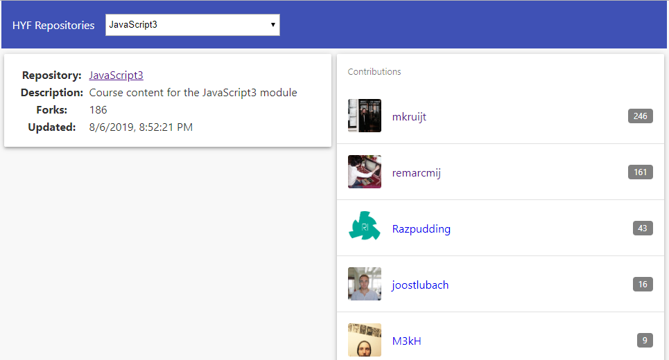

# Homework Week 2

The homework for this week build upon to homework of week 1.

## Step 1: Implement requested PR changes

- Fix Requested Changes (if any) on the Pull Request from week 1.

## Step 2: Create a new branch

1. Make sure that your `week1` branch is checked out and clean.
2. Create a new branch for the week 2 homework:

   ```
   git checkout -b week2
   ```

## Step 3: Enhance the application

The assignment is to enhance your application to look similar to the one illustrated in Figure 1 below. Instead of displaying details for _all_ repositories, this version should show information for a single repository and also list its contributors. The actual repository for which details are to be displayed should be selectable with a select box.



<small>Figure 1. Example User Interface using [Material Design](https://material.io/guidelines/) principles.</small>

The web page should include the following components:

1. An HTML `select` element from which the user can select a HYF repository. This `select` element must be populated with `option` elements, one for each HYF repository.
2. A left-hand column that displays basic information about the selected repository.
3. A right-hand column that displays a list of contributors to the repository.

A suggested HTML structure could be:

```html
<body>
  <div id="root">
    <header class="...">...</header>
    <main class="main-container">
      <section class="repo-container">...</section>
      <section class="contributors-container">...</section>
    </main>
  </div>
</body>
```

**Functional Requirements:**

1. The list of repositories in the `select` element should be sorted (case-insensitive) on repository name.
2. At start-up your application should display information about the first repository as displayed in the `select` element.
3. When the user changes the selection, the information in the web page should be refreshed for the newly selected repository.
4. You should be able to click on the repository name of the selected repository to open a new browser tab with the GitHub page for that repository.
5. You should be able to click on a contributor to open a new browser tab with the GitHub page for that contributor.
6. Your UI should be responsive. Try it with Chrome Developer Tools in the browser, using a mobile phone format and a tablet format, portrait and landscape.

**Code modifications:**

**`index.js`**

- Modify this file as required to meet the functional requirements of the assignment.
- Convert the callbacks to promises.

**`style.css`**

- Add your own styling.

**Hints:**

- Add one `option` element per repository to the `select` element, where each `option` element has the array index of the repository as its `value` attribute and the name of the repository as its text content:

  ```html
  <select>
    <option value="0">alumni</option>
    <option value="1">angular</option>
    <!-- etc -->
  </select>
  ```

* To sort the list repositories use [`.sort()`](https://developer.mozilla.org/en-US/docs/Web/JavaScript/Reference/Global_Objects/Array/sort) and [`.localeCompare()`](https://developer.mozilla.org/en-US/docs/Web/JavaScript/Reference/Global_Objects/String/localeCompare).

* Use CSS media queries and [Flexbox](https://css-tricks.com/snippets/css/a-guide-to-flexbox/) to make the UI responsive.

### Handing in your homework

If necessary, review the instructions how to [Hand in homework](https://github.com/HackYourFuture/fundamentals/blob/master/fundamentals/homework_pr.md) using GitHub pull request.

To test whether your code will be accepted when you submit your homework as a pull request you need to ensure that it does not contain ESLint errors. Open a terminal window in VSCode and type the following command:

```
npm test
```

If any errors or warnings are reported by this command you need to fix them before submitting a pull request.

In addition, check for the following:

- Have you removed all commented out code (should never be present in a PR)?
- Do the variable, function and argument names you created follow the [Naming Conventions](../../../../fundamentals/blob/master/fundamentals/naming_conventions.md)?
- Is your code well-formatted (see [Code Formatting](../../../../fundamentals/blob/master/fundamentals/code_formatting.md))?

If the answer is 'yes' to the preceding questions you are ready to follow these instructions:

1. Push your `week2` branch to GitHub:

   ```
   git push -u origin week2
   ```

2. Create a pull request for your `week2` branch.

Note:

1. Please remove all redundant, commented-out code and console.log's from your files before pushing your homework as finished. There is no need for your mentors to review this stuff.
2. Please make sure your code is well-formatted and follows the recommended naming conventions.

## Step 4: Read before next lecture

Go through the reading material in the [README.md](../Week3/README.md) to prepare for your next class.
