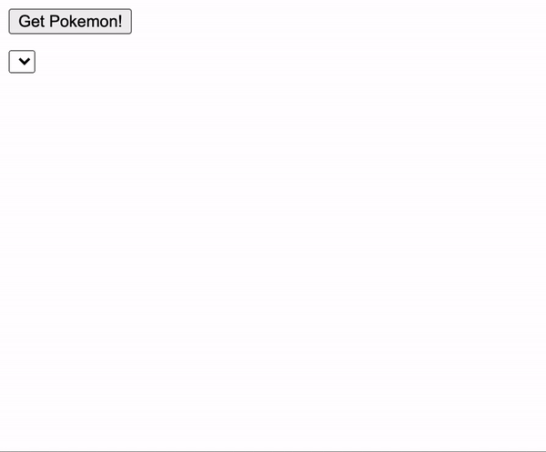

# Homework JavaScript3 Week 2

## **Todo list**

1. Practice the concepts
2. JavaScript exercises
3. Code along
4. PROJECT: Hack Your Repo II

## **1. Practice the concepts**

Let's start this week off with some interactive exercises! Visit the following link to get started:

- [Learn JavaScript: Promises](https://www.codecademy.com/learn/introduction-to-javascript/modules/javascript-promises)

## **2. JavaScript exercises**

> Inside of your `JavaScript3` fork and inside of the `Week2` folder, create a folder called `homework`. Inside of that folder, create a folder called `js-exercises`. For all the following exercises create a new `.js` file in that folder (3 files in total). Make sure the name of each file reflects its content: for example, the filename for exercise one could be `getName.js`.

**Exercise 1: John who?**

Take a look at the following function (and try it out in your console):

```js
const getAnonName = (firstName, callback) => {
  setTimeout(() => {
    if (!firstName)
      return callback(new Error("You didn't pass in a first name!"));

    const fullName = `${firstName} Doe`;

    return callback(fullName);
  }, 2000);
};

getAnonName('John', console.log);
```

Rewrite this function, but replace the callback syntax with the Promise syntax:

- Have the `getAnonName` function return a `new Promise` that uses the `firstName` parameter
- If the Promise `resolves`, pass the full name as an argument to resolve with
- If the Promise `rejects`, pass an error as the argument to reject with: "You didn't pass in a first name!"

**Exercise 2: Is it bigger than 10?**

Write a function called `checkDoubleDigits` that:

- Takes 1 argument: a number
- Returns a `new Promise`
- If the number is bigger than 10, resolve with the string: "The number is bigger than 10!"
- If the number is smaller than 10, reject with the error: "Error! The number is smaller than 10..."

**Exercise 3: Gotta catch 'em all**

> Inside of your `homework` folder, create another folder called `pokemon-app`. There, create an `index.html` and `script.js` file

Let's catch all original 151 Pokemon in our own little web application! Here's an example of what you'll be building for this exercise:



In this exercise you're going to do several things:

1. Create and append DOM elements using JavaScript only
2. Fetch data twice from a public API [PokeAPI](https://pokeapi.co/)
3. Display the results in the DOM.

Here are the requirements:

- Create 3 functions: `fetchData`, `addPokemonToDOM` and `main`
- The `main` function executes the other functions and contains all the variables
- In the `fetchData` function, make use of `fetch` and its Promise syntax in order to get the data from the public API
- Execute the `main` function when the window has finished loading

## **3. Code along**

In the following "code along" you'll be building a complete Weather App that makes use of the [Darksky API](https://darksky.net).

Enjoy!

- [Build a Weather App with Vanilla JavaScript Tutorial](https://www.youtube.com/watch?v=wPElVpR1rwA)

## **4. PROJECT: Hack Your Repo II**

> This week we'll continue building on our work from last week. Make sure to navigate to the `hackyourrepo-app` folder and start based on the code you wrote!

This week we'll do a couple of things:

1. We'll remove our HTML elements and remake them using JavaScript only!
2. We'll replace our placeholder data with real data from the GitHub API
3. We'll display this data in a separate column of the user interface

On the surface, it'll look exactly the same. But functionally, it'll based around JavaScript only!

Here are the requirements:

- Remove the HTML elements you created last week, and only keep the `<script>` tag (you can keep the styling)
- Recreate all the HTML elements using JavaScript
- Populate the `<select>` with options. Use the data fetched from the GitHub API, using this URL:

```js
const url = 'https://api.github.com/orgs/HackYourFuture/repos?per_page=100';
```

- When a user changes the option in the `<select>` tag, listen to that "change" event and make an HTTP Request to the GitHub API to get repository-specific data. Read the documentation to find out which URL you need to use: [GitHub API Documentation](https://developer.github.com/v3/)
- When the repository-specific has been fetched, populate the right columns: contributors and repository details.
- If there's an error in the HTTP Request, display the following:


- Create a `main` function that will execute all of your functions only when the window has fully loaded

The end result should be similar to this in styling, but exactly in functionality:

[](https://js3-spa.herokuapp.com/)
Click on the image to open up the demo of the application!

Good luck!

## **SUBMIT YOUR HOMEWORK!**

After you've finished your todo list it's time to show us what you got! The homework that needs to be submitted is the following:

1. PROJECT: HackYourRepo II

Upload your homework to your forked JavaScript3 repository in GitHub. Make a pull request to your teacher's repository.

> Forgotten how to upload your homework? Go through the [guide](../hand-in-homework-guide.md) to learn how to do this again.

_Deadline Saturday 23.59 CET_
