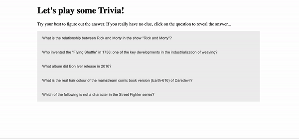

# Homework JavaScript3 Week 3

## **Todo list**

1. Practice the concepts
2. JavaScript exercises
3. Code along
4. PROJECT: Hack Your Repo III

## **1. Practice the concepts**

Let's continue exercising those programming muscles! Go through the following exercises:

- [Learn JavaScript: Objects](https://www.codecademy.com/learn/introduction-to-javascript/modules/learn-javascript-objects)
- [Learn JavaScript: Classes](https://www.codecademy.com/learn/introduction-to-javascript/modules/learn-javascript-classes)
- [Learn JavaScript: Async/Await](https://www.codecademy.com/learn/introduction-to-javascript/modules/asynch-js)

## **2. JavaScript exercises**

> Inside of your `JavaScript3` fork and inside of the `Week3` folder, create a folder called `homework`. Inside of that folder, create a folder called `js-exercises`. For all the following exercises create a new `.js` file in that folder (3 files in total). Make sure the name of each file reflects its content: for example, the filename for exercise one could be `getName.js`.

**Exercise 1: Promise me to wait**

In this exercise you'll practice refactoring `Promise` syntax into `async/await` + `try/catch` syntax. Rewrite exercise A & B using `async/await` + `try/catch` syntax.

```js
// Exercise A
function getData(url) {
  fetch(url)
    .then(response => response.json)
    .then(json => console.log(json))
    .catch(error => console.log(error));
}

getData('https://randomfox.ca/floof/');

// Exercise B
const arrayOfWords = ['cucumber', 'tomatos', 'avocado'];

const makeAllCaps = array => {
  return new Promise((resolve, reject) => {
    let capsArray = array.map(word => {
      if (typeof word === 'string') {
        return word.toUpperCase();
      } else {
        reject('Error: Not all items in the array are strings!');
      }
    });
    resolve(capsArray);
  });
};

makeAllCaps(arrayOfWords)
  .then(result => console.log(result))
  .catch(error => console.log(error));
```

**Exercise 2: Classify**

In this exercise you'll read a little story. It's your job to turn the characters in it into classes and instantiate the class into the characters you read about!

```md
# STORY

Abdulkareem is a 35 year old man, that lives in Riyadh. He has a wife and 3 children. As a day job he's a construction worker, that makes houses. He likes to eat dates and smoke water pipe.

Abdulkareem has a horse, named Adel. The horse is 15 years old and has the color brown. Usually the horse eats grass or helps transport materials for Abdulkareem.

And they lived happily ever after!
```

After reading this story, you have to:

- Create a class for Adbulkareem and Adel
- Instantiate those classes to create an Abdulkareem object and Adel object

**Exercise 3: Trivia time!**

Don't you just love trivia games? Let's make our own!

In this exercise you'll make use of the [Open Trivia Database API](https://opentdb.com/). You are going to fetch 5 random trivia questions and then inject them into the DOM, inside of an accordion. It should behave similar to this:



Here are the requirements:

- Create a folder called `trivia-app`, that includes an HTML, CSS and JavaScript file
- Link them all together in the HTML file
- Only provide the basic structure in the HTML file. All other DOM elements are to be created using JavaScript
- No CSS frameworks are allowed!
- Sometimes the strings you get back from the API contains HTML entities (like `&quote;`). Find out a way to turn this into regular text
- Make use of the following endpoint: https://opentdb.com/api.php?amount=5

## **3. Code along**

In this weeks `code along` you'll be building a Bookmarker application. It'll allow a user to add in URLs of their favorite websites in order to save it into a list.

Happy learning!

- [BookMarker Application](https://www.youtube.com/watch?v=32qhBZacCNc)

## **4. PROJECT: Hack Your Repo III**

> This week we'll continue building on our work from last week. Make sure to navigate to the `hackyourrepo-app` folder and start based on the code you wrote!

Our application is looking pretty nice so far! This week we'll do 2 things:

1. We'll refactor and modularize our application
2. We'll add a feature: pagination!

Let's break each of them apart.

### 4.1 Refactor and modularize application

We'll first start off with refactoring, so that we have a clean codebase to build upon.

Like you've learned this week, refactoring is all about writing "clean code": code that is readible and easy to add to.

When writing the JavaScript code last week, most likely you wrote everything in a single JavaScript file (the `script.js` one). This week we'll create many more files, that we then will all bring together in that `script.js` file to execute. This act is called `modularization`, and you'll practice with this more and more as time goes on.

Next to that you'll refactor your code using the software design principles you've learned about this week: DRY, KISS and others you might have picked up. How does would look like exactly in your codebase is left up to you.

Here are the requirements:

- Create a separate `.js` for every function you create
- Import all top-level functions into the `script.js` file to execute when the window has loaded
- Rewrite your logic to be as simple as possible. Use loops and logical operators when needed
- Rename your functions and variables to be as semantic as possible
- Store all your JavaScript files, besides `script.js` in a folder called `util` (short for utility functions)

> Utility functions are reusable functions that are made to solve common problems. They are regular functions that perform tasks like: performing a calculation, transform one data type into another or perform a DOM operation.

### 4.2 Add a feature: Pagination

You might have noticed that when a user selects a repository that has many contributors, the page's height becomes bigger and bigger (thus forcing the user to scroll down). Let's change that by adding pagination!

What is pagination? Take a look at this:


In the illustration, each number represents a page. You might have seen it before on websites like Amazon, when you're browsing through different products.

We'll replicate this functionality to allow a user to browse through different contributors without have to scroll incessantly.

Here are the requirements:

- Each "page" should contain at maximum 5 contributors. If the repository selected contains more than 5 contributors, it will get split up unto a different page (and thus create another addition)
- Slice the array into smaller parts and create a new page every time the maximum has been reached
- Allow a user to click from page to page by clicking on the number, or an arrow to go one page forward or backward

Good luck!

## **SUBMIT YOUR HOMEWORK!**

After you've finished your todo list it's time to show us what you got! The homework that needs to be submitted is the following:

1. PROJECT: HackYourRepo III

Upload your homework to your forked JavaScript3 repository in GitHub. Make a pull request to the teacher's forked repository.

> Forgotten how to upload your homework? Go through the [guide](../hand-in-homework-guide.md) to learn how to do this again.

_Deadline Saturday 23.59 CET_
