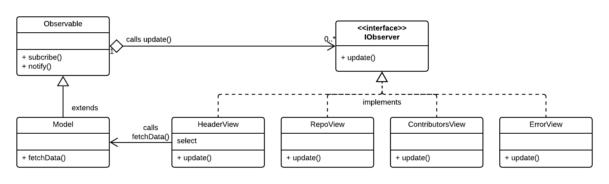

# Homework JavaScript3 Week 3

## **Todo list**

1. Practice the concepts
2. JavaScript exercises
3. Code along
4. PROJECT: Hack Your Repo III

## **1. Practice the concepts**

Let's continue exercising those programming muscles! Go through the following exercises:

- [Learn JavaScript: Objects](https://www.codecademy.com/learn/introduction-to-javascript/modules/learn-javascript-objects)
- [Learn JavaScript: Classes](https://www.codecademy.com/learn/introduction-to-javascript/modules/learn-javascript-classes)
- [Learn JavaScript: Async/Await](https://www.codecademy.com/learn/introduction-to-javascript/modules/asynch-js)

## **2. JavaScript exercises**

**_No exercises this week_**

## **3. Code along**

In this weeks `code along` you'll be building a website that uses the YouTube API to fetch channel data and videos. You'll be creating a search form to change channels and use [OAuth2](https://www.youtube.com/watch?v=CPbvxxslDTU) to login and logout.

Happy learning!

- [YouTube API Project with Authentication](https://www.youtube.com/watch?v=r-yxNNO1EI8)

## **4. PROJECT: Hack Your Repo III**

The final week's assignment consists of two parts.

In the first part you will update the homework from week 2 (in the `homework` folder). In the second part you will refactor your application to use `ES6 classes`. For this, you need to modify the files in the `homework-classes` folder.

### PART 1: `async/await` & `axios`

In the first part you'll need to modify some parts of your code with what you've learned about. Implement the following:

### OOP and ES6 classes

In this second part requires you'll work with a codebase that is build in the Object Oriented Programming paradigm (OOP). OOP is a vast topic and in this homework we can only scratch the surface. The approach we have taken here is for you, as aspiring junior developer, to complete an application for which the groundwork has been done by an experienced developer. You may find it difficult to understand the full details of the application, however this is not unlike a real world situation where you will be expected to make relative small modifications to a complex application, without breaking anything.

### Getting an overview

The relevant files for this part of the homework can be found in the **homework-classes** folder. In the following table you'll find an outline (with explanations about their role in our application):

| File                | Description                                                                                            |
| ------------------- | ------------------------------------------------------------------------------------------------------ |
| index.html          | The application's HTML file.                                                                           |
| style.css           | CSS styling.                                                                                           |
| hyf.png             | The HYF logo.                                                                                          |
| App.js              | The **App** class is the main container class for the app.                                             |
| Observable.js       | The **Observable** class is a base class implementing functionality of the Observer pattern.           |
| Model.js            | The **Model** class is concerned with all data handling (e.g. fetching). Extends the Observable class. |
| HeaderView.js       | The **HeaderView** class renders the header with the select element.                                   |
| RepoView.js         | The **RepoView** class renders the details for the selected repository.                                |
| ContributorsView.js | The **ContributorsView** class renders the contributors for the selected repository.                   |
| ErrorView.js        | The **ErrorView** class renders an error, if present.                                                  |
| Util.js             | The **Utility** class provides (static) utility functions.                                             |

Like mentioned in the readings, the point of OOP is to split your application up into "entities". These entities then work together like a team in order to make an application work.

The image below illustrates the interrelationship between the various classes in the application using a [UML Class Diagram](https://en.wikipedia.org/wiki/Class_diagram).

### A first examination

You can conclude the following from this diagram:

1. The **Model** class **extends** (_inherits from_) the **Observable** class. Views (i.e., 'observers') can subscribe to the Model and get notified on data updates.
2. There are four View classes that implement the **IObservable** interface, i.e. they implement the required `update()` method:

   - **HeaderView**
   - **RepoView**
   - **ContributorsView**
   - **ErrorView**.

3. The **SelectView** class calls the `fetchData()` method from the **Model** class to request a data fetch.

4. There are four View classes that implement the **IObservable** interface, i.e. they implement the required `update()` method:

   - **HeaderView**
   - **RepoView**
   - **ContributorsView**
   - **ErrorView**

### Week 3 Assignment

**PART 1: Modify your existing code base**

In the `homework` folder, modify the following:

1. Refactor all `.then()` and `.catch()` methods with `async`/`await` and `try...catch`.
2. Make sure that your error handling code still works. See the instructions from week 2's [homework](../Week2/MAKEME.md) on how to force an error response from GitHub.
3. Modify the `fetchJSON` function to replace **fetch** with **axios**.
4. Add a `<script>` tag to **index.html** to load the **axios** library from a CDN ([Content Delivery Network](https://www.youtube.com/watch?v=52VSbXBlfdc)) site. Use Google to find the right URL.

**PART 2: Moving to the OOP version of the homework**

In the `homework-classes` folder, modify the following:

1. Modify the **RepoView.js** and **ContributorsView.js** files, by adding and adapting code from your non-OOP version of the homework to these files.
2. You should also copy the styling from your non-OOP version.
3. Make sure everything still works!

Good luck!

## **SUBMIT YOUR HOMEWORK!**

After you've finished your todo list it's time to show us what you got! The homework that needs to be submitted is the following:

Upload your homework to your forked JavaScript3 repository in GitHub. Make a pull request to the teacher's forked repository.

> Forgotten how to upload your homework? Go through the [guide](../hand-in-homework-guide.md) to learn how to do this again.

_Deadline Saturday 23.59 CET_
